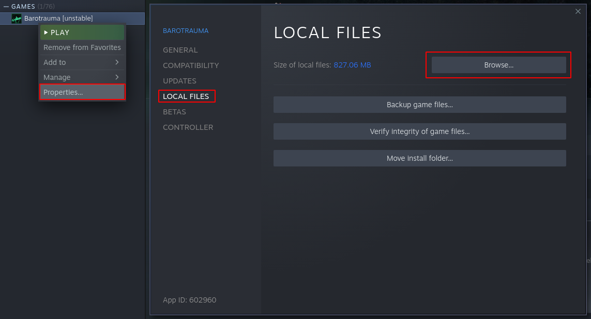
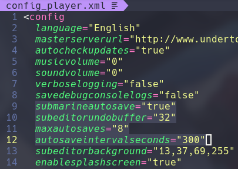
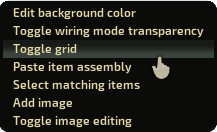
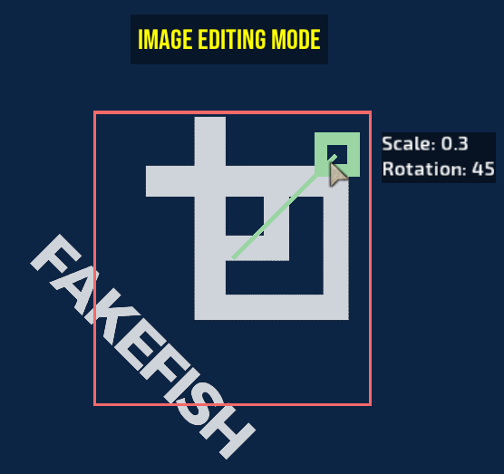
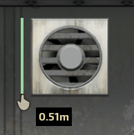
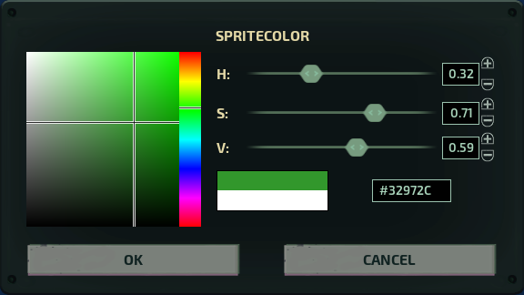
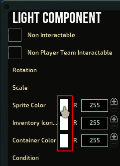
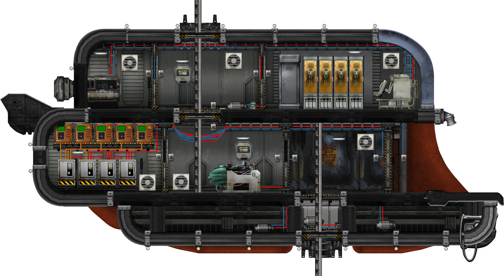

# Diving deeper into the sub editor

*Written by 3e849f2e5c*

## Who are you, what do you want and why does your name look like my WiFi password?


Most people call me “Aneko” but I’m better known as “Hex” or “Hexcode Guy” by the community but you can call me whatever you want.

I’m a developer for Barotrauma best known for my bad memes on [Undertow Games Discord](https://discord.com/invite/undertow)  and I’ve implemented a handful of improvements into the sub editor over the year and accept new suggestions with open arms granted I’m not swamped with work already.

It has come to my attention that a big portion of the sub builders do not know about many of these features so I’m here to showcase many of the lesser known ones and will be updating this guide when new ones are implemented.

Please note however that I have no experience in building subs myself thus it’s all up to you how you utilize these features.


## Bypassing the price limiter
If you’ve ever wanted to start a campaign to test your submarine in action but the 6,000 mark price limit has prevented you from starting the campaign then this tip is for you.

In the main menu you can open the debug console using F3 and using the command
```
debugdraw
```
will put a lot of text, lines and rectangles on your screen but fear not you don’t need to pay attention to any of them.
Upon selecting “New Game” with debugdraw enabled the price limiter will be disabled and you are free to select any submarine even if it’s marked red.

After starting the campaign you most likely want to disable debugdraw by running the command in the debug console again as it’s quite distracting and heavy on the framerate.
Do note that you need to enable debugdraw before selecting New Game as the price limiter will be lifted when the interface is constructed.

Alternatively you may use the command
```
quickstart <submarine>
```
replacing **&lt;submarine&gt;** with the full name of your submarine for example **quickstart “Typhon 2”** . This will start a singleplayer sandbox in a random level with the submarine you specified.


## Configuration file
Where your game is installed you can find a file called **config_player.xml** which contains some settings for the submarine editor. To find where the game is installed go to
```
Steam -> right click “Barotrauma” -> Properties -> Local Files -> Browse
```
this will open your file manager at the location and you should be able to locate config file. There are not many options but you might find some of them useful.


- **submarineautosave** \- Setting this to “false” will completely disable any new auto saves from being created, I recommend not disabling it unless it’s causing you issues.


- **subeditorundobuffer** \- Changing this value will change the maximum amount of actions that can be undone at a time, beware that high values might cause high memory usage.


- **maxautosaves** \- Increasing this value will increase the amount of auto saves the game will store before it starts deleting old ones.


- **autosaveintervalseconds** \- Determines how often the game autosaves the currently loaded submarine in seconds, the default is 300 which means every 5 minutes.



## The not-so-secret context menu
A “secret” context menu can be accessed by holding shift and right clicking anywhere in the world, this menu includes many of the features I’ve implemented with the lack of a better place to store them.

- **Edit background color** \- Brings up a popup that lets you change the background color of the editor, setting the color persists between restarts.


- **Toggle wiring mode transparency** \- By default when you enter wiring mode any non\-wiring related items will have reduced opacity, selecting this option will toggle that behavior.


- **Toggle grid** \- Selecting this option will toggle a global grid in the submarine editor.


- **Paste item assembly** \- Allows you to paste item assemblies from your system clipboard, see the dedicated section down below for more info.


- **Select matching items** \- When you have at least one item selected this option allows you to select all items that are included in your selection.


- **Add image** \- Allows you to add background images to the editor.


- **Toggle image editing** \- Toggles image editing mode which allows you to move, scale and rotate background images. See the next section for more details on how to use background images.



## Background images
This feature allows you to add custom images behind your submarine. These images are global and persist between game restarts.
You may edit the images by toggling image editing mode which puts all the images in front of the sub and shows a knob which can be used to resize and rotate the image.

Image editing mode keybinds are:
- **Primary click** \- Select an image.

- **Delete / Ctrl+D** \- Delete the selected image.

- **Space** \- Toggle the selected image between world space and camera space.

- **Up/Down arrow keys** \- Change the opacity of the image.

- **Shift** \- Round the rotation to 45 degrees.

- **Ctrl** \- Snap the scale to 0.1 intervals.



## Pasting item assemblies
This feature allows you to easily share item assemblies. Simply copy the text inside an item assembly to your system clipboard and select the option in the secret menu to paste it in. For example you can copy the XML below to your clipboard and pasting the assembly should create a red junction box.


```xml
<?xml version="1.0" encoding="utf-8"?>
<ItemAssembly name="junctionbox" description="Just a junction box" hideinmenus="false">
  <Item name="" identifier="junctionbox" ID="3" rect="-31,56,55,88" noninteractable="False" nonplayerteaminteractable="False" rotation="0" scale="0.5" spritecolor="255,0,0,255" inventoryiconcolor="255,255,255,255" containercolor="255,255,255,255" condition="100" invulnerabletodamage="False" tags="junctionbox,light" displaysidebysidewhenlinked="False" disallowedupgrades="" spritedepth="0.8" hiddeningame="False">
    <PowerTransfer canbeoverloaded="True" overloadvoltage="2" fireprobability="0.15" isactive="True" minvoltage="0" powerconsumption="0" vulnerabletoemp="True" pickingtime="0" canbepicked="False" allowingameediting="True" msg="ItemMsgInteractSelect" />
    <LightComponent range="10" castshadows="False" drawbehindsubs="False" ison="True" flicker="0" flickerspeed="1" pulsefrequency="0" pulseamount="0" blinkfrequency="0" lightcolor="255,255,255,0" isactive="True" minvoltage="0.5" powerconsumption="1" vulnerabletoemp="True" pickingtime="0" canbepicked="False" allowingameediting="False" msg="" />
    <LightComponent range="10" castshadows="False" drawbehindsubs="False" ison="False" flicker="0" flickerspeed="1" pulsefrequency="0" pulseamount="0" blinkfrequency="1.5" lightcolor="255,255,255,0" minvoltage="0.5" powerconsumption="1" vulnerabletoemp="True" pickingtime="0" canbepicked="False" allowingameediting="False" msg="" />
    <ConnectionPanel locked="False" pickingtime="0" canbepicked="False" allowingameediting="True" msg="ItemMsgRewireScrewdriver">
      <requireditem items="screwdriver" type="Equipped" optional="false" ignoreineditor="false" excludebroken="true" />
      <output name="power" />
      <output name="signal_0" />
      <output name="signal_1" />
      <output name="signal_2" />
      <output name="signal_3" />
    </ConnectionPanel>
    <Repairable deteriorationspeed="0.1" mindeteriorationdelay="120" maxdeteriorationdelay="720" mindeteriorationcondition="0" repairthreshold="80" fixdurationlowskill="25" fixdurationhighskill="5" pickingtime="0" canbepicked="False" allowingameediting="True" msg="ItemMsgRepairScrewdriver">
      <requireditem items="screwdriver" type="Equipped" optional="false" ignoreineditor="false" excludebroken="true" />
    </Repairable>
  </Item>
</ItemAssembly>
```


## Measuring distance
The measuring tape can be used to calculate distance between 2 points in meters. To use this feature, hold Alt and primary click at the same time and a green line and a tooltip telling you the distance between the original point and your current mouse position will appear.




## HSV color picker
The advanced color picker allows you to change and visualize colors better and can be accessed by clicking on the corresponding color preview square on the right hand property editor. This works for any color, not just sprite color.

 


## High resolution screenshots
This feature was implemented to help getting screenshots for the official [Barotrauma wiki](https://barotraumagame.com/wiki/Main_Page)  but you may find it useful too.

When you have your submarine opened in the editor you can open the debug console and run the command

```
wikiimage_sub
```
make sure you aren't hovering over any items as the orange tint will be included in the screenshot too.

After a short freeze the game will save a 4K screenshot of the submarine with a transparent background where your game is installed with the name **wikiimage.png** . Refer to the configuration file section to find where your game is installed.




## Other tips & tricks
If you want to move a wire from one connection panel to another you can pick it back into your hand in wiring mode by first disconnecting the wire from the pin, closing the connection panel and double clicking the disconnected end of the wire.

If you want to place items and structures more precisely than the game allows you to, you can achieve this by using arrow keys or by holding shift while dragging the item. Holding shift while resizing a wall will also disable grid snapping.

Normally when you place down a wall in the sub editor it will be removed from your selection meaning you have to re\-select it from the entity menu but if you hold shift while releasing the mouse it will keep the wall selected allowing you to place multiple walls in quick succession.

The submarine editor supports dragging and dropping certain files into the game window to load them.
These files include:
- **.sub** files to load the submarine in the editor.

- **.xml** file to load an item assembly at the position you drop it in.

- **.png** and **.jpg** files when the save screen is open to select the thumbnail.


## Keybinds
This section is just a list of **all** possible keybinds in the sub editor.
- **F** \- Center camera to selection.

- **Q** \- Toggle item list.

- **E** \- Open inventory or interface of currently highlighted item.

- **Space** \- Preview discharge coil when one is selected.

- **Delete** \- Delete selected items.

- **Arrow keys** \- Nudge selection by the smallest possible amount.

- **Ctrl+A** \- Select/deselect all items.

- **Ctrl+X** \- Cut selection.

- **Ctrl+C** \- Copy selection.

- **Ctrl+V** \- Paste selection to the center of the screen.

- **Ctrl+G** \- Group selection together.

- **Ctrl+1** \- Edit mode.

- **Ctrl+2** \- Wiring mode.

- **Ctrl+Z** \- Undo.

- **Ctrl+Y** \- Redo.

- **Ctrl+Shift+Z** \- Alternative redo.

- **Ctrl+M** \- Flip all items in the selection on the Y axis.

- **Ctrl+N** \- Flip all items in the selection on the X axis.

- **Ctrl+S** \- Save.

- **Ctrl+Shift+S** \- Quick save.  You can also use number keys in wiring mode to select a wire instead of clicking the menu.


## Console command
List of all sub editor related debug console commands, some are useful and some obsolete.
- **autohull** \- Automatically generates hulls on the submarine, the hull generation isn't perfect so manual hulling is recommended.


- **multiplylights** \- Multiplies the color of all the lights on the currently loaded submarine by an amount.


- **color** \- Changes to sprite color of the section.


- **resetall** \- Resets all items on the currently loaded submarine to prefab.


- **resetentitiesbyidentifier** \- Reset all items with a given identifier or a tag to prefab.


- **resetselected** \- Reset all selected items to prefab.


- **alpha** \- Sets the sprite color alpha of all selected items.


- **save** \- Saves the currently loaded submarine with a given name.


- **setentityproperties** \- Sets properties of the selected items, can be used to change properties that are not exposed to editor but many properties do not save.


- **refreshrect** \- Recalculates rectangles of all selected items.


## Final words
Best of luck to your future submarine designs, hopefully you learned something new and can enjoy the submarine editor as much as I did while developing it.

