# Submarine editor

## Hello subwrights!
*Written by TorpedoMike, Chad Husk and Hexcode Guy*

This is the Barotrauma dev team's official manual for building your own fleets. It's the second version, updated to include the various changes to the editor, especially the reworked character mode. This guide will hopefully help you get a handle on the most important aspects of sub building by introducing the key concepts and functions of the submarine editor.

**TIP:** Up\-and\-coming sub designers can find some dev\-made examples [here](https://steamcommunity.com/sharedfiles/filedetails/?id=2218926158) about how to setup the most essential systems of any submarine in the editor.

## Submarine structures
Different kinds of walls and platforms are used to keep oxygen inside and monsters outside, and to divide the interior space into smaller rooms and compartments.

When making a new submarine, it’s always a good idea to have a general plan of its shape and layout before building the outer hull. It’s a lot easier to add room inside for that oxygen generator you forgot to include, at first, if you don’t have to move all those carefully placed shell pieces, fins and lights just to create a bit more space. So starting with the outside hull is not necessarily the best course of action.

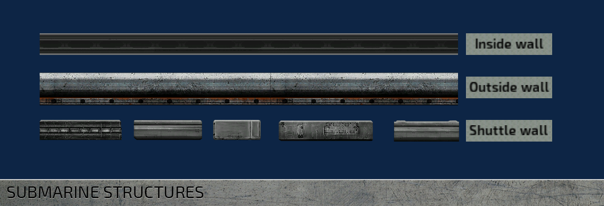

Outside walls are by default sturdier than inside walls. Shuttle wall pieces are somewhere in between. You can edit the "max health" for each wall piece individually. This value is used as the base health for the walls, boosted multiplicatively by the hull upgrades the player can buy.

We suggest using the walls as labeled for a more balanced experience, but of course it’s not mandatory. Best results often come when experimenting with different options.

After a piece of a wall \(or most things in the editor, really\) is placed, it can be **flipped** by it’s x\- or y\-axis by selecting it and pressing ‘Mirror X’ and ‘Mirror Y’ \-buttons or CTRL+N or CTRL+M. Nudge it via the arrow keys.

**TIP:** If you’re feeling lost or need inspiration, open one of the ready\-made submarines in the editor and take a look at how they’re built.

**TIP:** Tall subs tend to be less usable than long subs, and can look a little weird and off balance when in play. Crew should probably not need to climb up 5 stories of ladders to get to a leak or a fire.

## Hulls and gaps
Rooms inside subs in Barotrauma are defined by **hull** objects. If there are no hulls in the sub, there is nothing separating the sub from the water outside. Hulls also determine the overall size \(= volume and mass\) of the sub.

Hulls are displayed in the sub’s status monitor. Along with a room’s name, the monitor is capable of displaying the water level and quality of oxygen in a room. You can change what information is shown and if any sensors are required by modifying the status monitor.

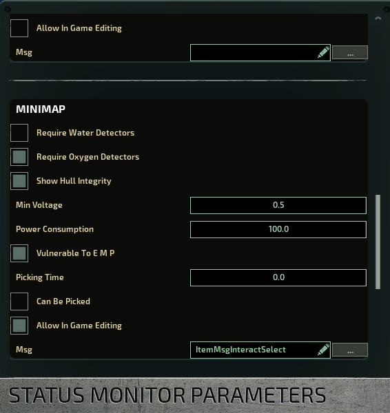

In non\-rectangular rooms, it’s often necessary to use multiple hull objects to cover the whole area. Link hulls together by selecting one hull, then holding space and clicking on another. This way linked hulls are displayed as a one, larger set. It also helps AI characters perceive linked hulls as a single room.

**TIP** : Hulls can be named in the editor. The main purpose this serves is to provide an easy, customizable way to refer to different spaces. In some cases the AI also uses hull names to navigate, and, for example, bots prefer to use hulls with ‘airlock’ in their name when entering/exiting the submarine.

Where hulls separate spaces, **gaps** connect them, allowing water and oxygen to flow from hull to another. Gap objects are placed automatically between hulls when a door or hatch is placed. For neighboring hulls with no walls, doors or hatches between them, a gap has to be placed manually for the water and oxygen to flow between the hulls. In the editor, red color means that a gap is currently closed, while blue means it is open \(you may need to reopen the editor for the colors to update\).

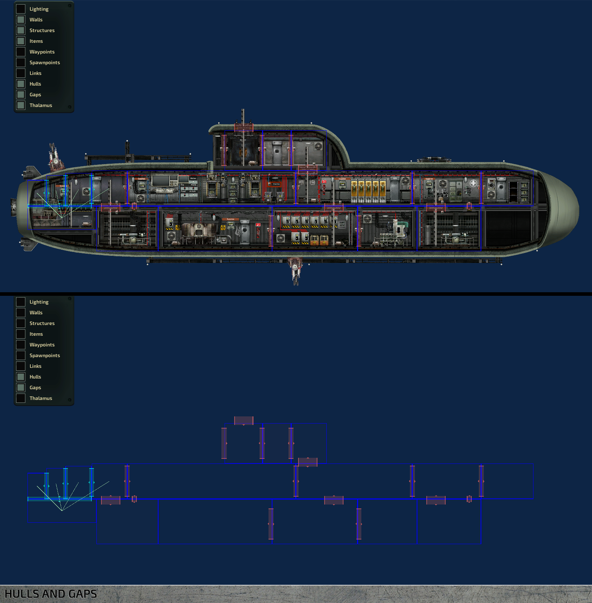

## Wiring
A good number of devices in a submarine have to be wired into a power source to be powered, while others rely on specific signals, also delivered via wiring, to work in the way they’re intended. Entering the wiring mode in the sub editor allows you to run wires between devices like you would in\-game. When wiring mode is toggled on, a selection of differently colored wires appears on the left hand side. Color differences are purely cosmetic, but there is a tradition of using red wires for power and blue for signals.

After selecting a wire, it is added to your inventory and equipped, along with a screwdriver. From here, wiring works like it does in\-game. With the wire equipped, open the item’s wiring interface \(default ‘E’\) to add connections. Please refer to the in\-game Engineer training for more details.

When a wire is placed, it can be selected by clicking on it in wiring mode. Add a node by CTRL+clicking on the length of a wire. Move points by left\-clicking and dragging.

## Nuclear reactor and power grid
The **nuclear reactor** is the source of almost all the power on board the submarine. It is the engineers' responsibility to keep reactors running, so each reactor in the sub should be assigned an engineer. In most cases, having one is enough. They have a tendency to overheat and eventually explode if not operated correctly, so place them a safe distance away from other vital devices.

Power is distributed through the sub via **junction boxes** , as devices cannot draw power straight from the reactor. Power wires need to be connected to junction boxes to calculate the grid’s power load correctly.

There are two major ways to wire power in a sub.
- Place junction boxes in each room, close to devices they're providing power to, or
- Group all junction boxes in a separate electrical room, where they can all be easily accessed.

The first solution makes troubleshooting easier, because problems can usually be traced to the closest junction box. On the other hand, grouping all junction boxes together makes them easier to maintain.

**TIP:** In most cases, it’s smart to keep everything in the same grid because the reactor always outputs the same amount of power to each grid. If there are two power grids with different loads, the one with the lower load will be overloaded and its junction boxes damaged. If you want to use multiple power grids, make sure their power requirements are balanced.

**TIP:** Install wires along walls and ceilings and use cable holders. It looks neater and more organized.

## Engines, ballast and navigation
**Engines** provide thrust. You must place the engine so that its back half is in water and the front half inside the sub, or it will be damaged by water. You can use multiple engines to apply more force, but keep in mind their power consumption, which can be high and fluctuate when changing direction sharply.

An engine’s maximum force can be adjusted in the editor. This is useful if the sub’s horizontal movement can’t keep up with its ascent/descent speed or vice versa, which makes steering very difficult \(and can and will result from the engines and ballasts being out of balance\).

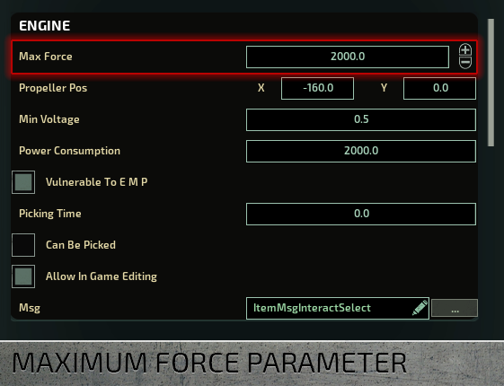

Where engines provide horizontal movement, **ballast tanks** are responsible for vertical movement. In their simplest state, they are empty rooms that contain a water pump. The pump is programmed to let water in to make the sub heavier or pump it out to make it lighter. This results in the sub either ascending or descending.

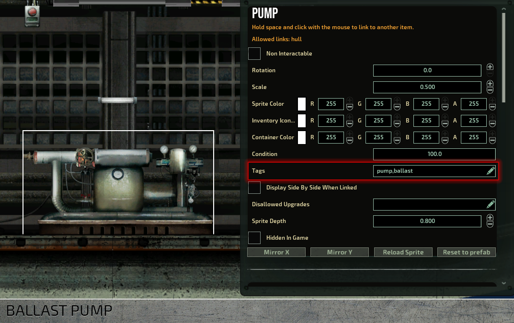

**TIP:** There can be any number of ballast tanks, although an optimal number is two or even three. One ballast can be fine, but then you run the risk of the sub being completely immobile if it gets punctured.

**TIP:** A natural place for a ballast tank would be on the bottom. Otherwise you will run into all kinds of issues ranging from leaks to maintenance problems.

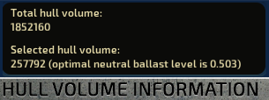

The size of a ballast tank is an important factor in a sub’s handling. If it’s too small, the sub may not be able to descend; too big, and it may sink too easily. Aim for a combined neutral ballast level of .5 for optimal size. The size of a hull is shown in the upper left corner of the viewport when a hull is selected. Selecting multiple hulls will give their combined optimal neutral ballast level. Neutral ballast levels that differ from the standard .5 can be taken into account in the navigation terminal. Look for a ‘Neutral Ballast Level’ field and change it to whatever is suitable.

Engines and ballast levels are controlled via the navigation terminal. The terminal parses the direction given by the navigator in the sonar display and sends a signal to the engine \(‘velocity_x_out’ to ‘set_force’\) and ballast pumps \(‘velocity_y_out’ to ‘set_targetlevel’\).

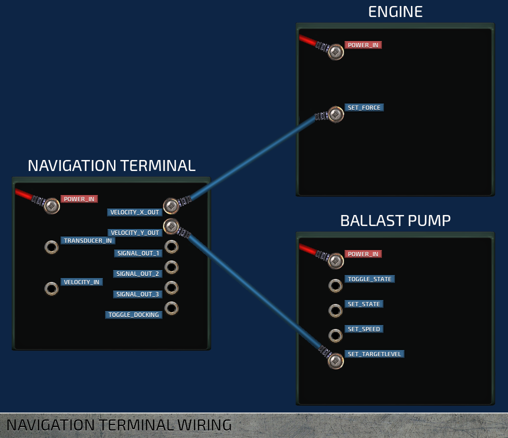

## Weapons systems
Turrets are the basic defense measure any standard sub should have. All turrets consists of a gun to launch the projectiles, a loader to load the ammunition, and a periscope to control the gun.

All turrets use a lot of power in short bursts when they fire. These power spikes are more than regular batteries can handle, which can causes the power grid to fluctuate wildly. Therefore, it's best to use supercapacitors to power the sub's guns. Their capacity is low and the output high.

For any type of turret to work, their loaders must be linked to the gun \(by selecting one, then holding space and clicking on the other\) and a periscope must be placed somewhere to control them. Periscopes output a ‘position_out’ and a ‘trigger_out’ signals, which should be connected to ‘position_in’ and ‘trigger_in’ inputs in the turret itself.

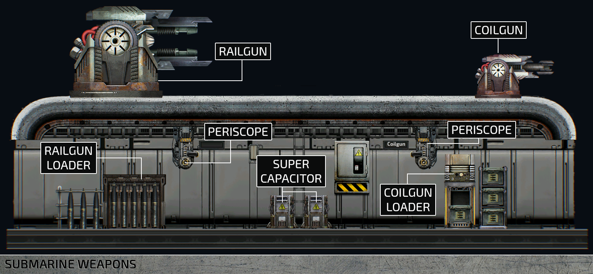

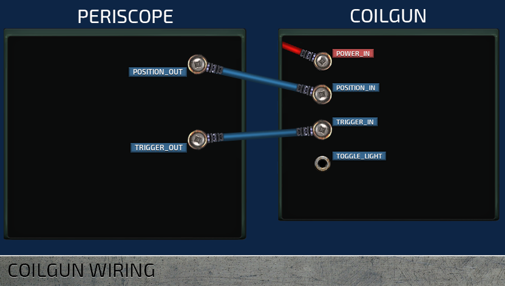

**Depth charges** require a depth charge loader and a tube. Depth charge loaders should be linked to depth charge tubes on the outer hull. Charges are launched by giving the tube an activation signal, usually via a button.

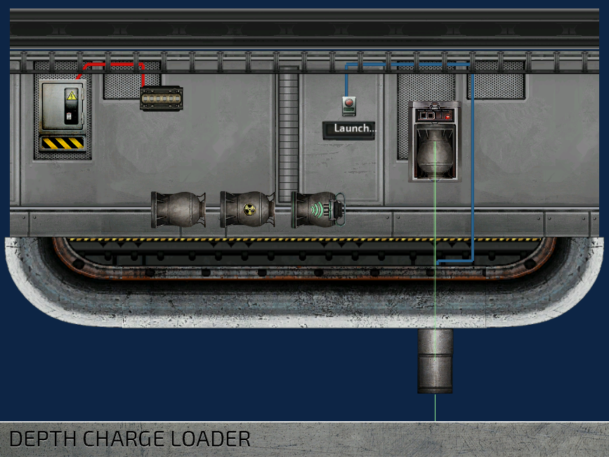

**Electric discharge coils** work similarly to depth charges. They need to be wired into the power grid and given an activation signal. The actual coil is placed on the outer hull. When activated, the coil creates an electrical discharge that travels along the submarine’s outer hull and stuns any monsters nearby. The range of the electric shock created is set in the discharge coil item in the editor along with a multiplier when traveling along walls.

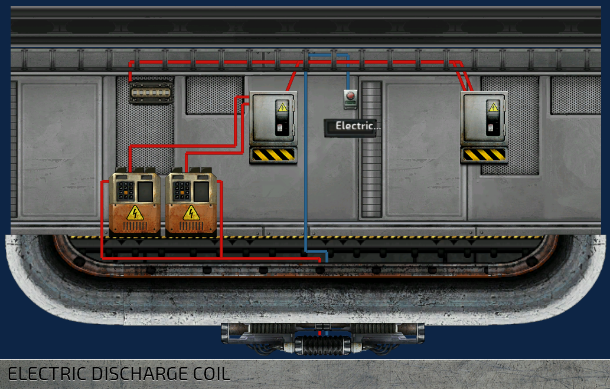

## Oxygen
**Oxygen generators** generate oxygen and thus breathable air for the entire sub. Like everything else on board, they require power to function, and they must be linked to an oxygen vent in any hull that is supposed to have breathable air. To link the generator to a vent, select the oxygen generator, then hold space and click the vent. You should see a green line between the items. If not, check if you have ‘Links’ displayed on the left hand side of the screen. If not, check if you have ‘Links’ toggled on in the visibility list.

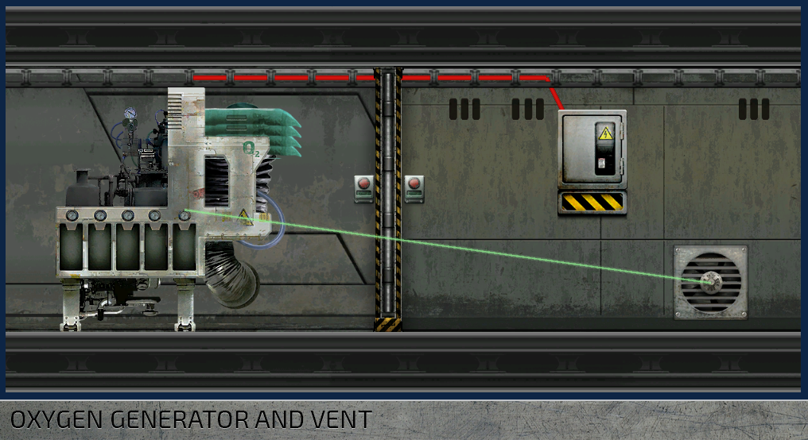

The amount of oxygen needed is based on the hull volume and the size of the crew. Oxygen levels are hull specific, which means the more crew members in a hull, the more quickly its oxygen level is depleted. Oxygen moves between hulls via gaps.

## Airlock, docking and cargo bay
Any submarine worth its salt has a way for a person to enter and exit it without excessive flooding. A standard **airlock** has a setup of multiple doors that stop the water before it gets further inside and a water pump to get rid of it once the airlock is closed.

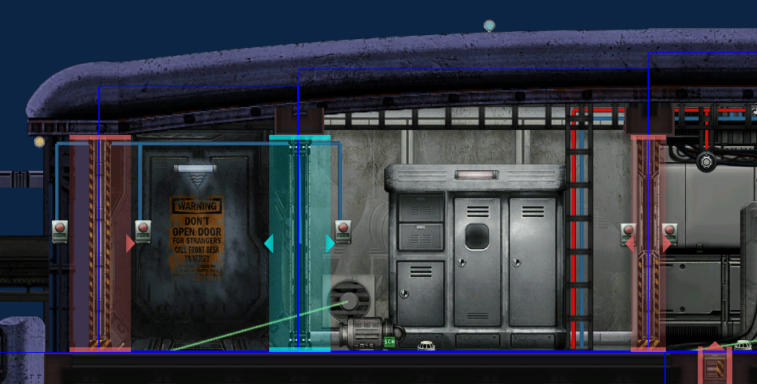

**Docking ports** are devices that clamp two structures \(submarines, shuttles, outposts etc.\) together, making it possible to walk from one to the other without getting your feet wet. Docking ports act independently from hatches and doors, so remember to also place a hatch wherever a port is to control passage.

**TIP:** A good way to wire a docking port is to link it to its hatch. When the port is engaged, the hatch opens. Find a working example in the sub editor’s Item assemblies category.

## Containers
There are quite a lot of items in the game, which the player can find or buy in the stores. All these items need a place somewhere in the submarine, and for that we need various containers. You can set a container to be filled automatically by enabling the 'Auto Fill' flag for the 'ItemContainer' component. For the autofilling to work, you'll need to mark the container with a tag, so that the game knows what kind of items the container should contain.

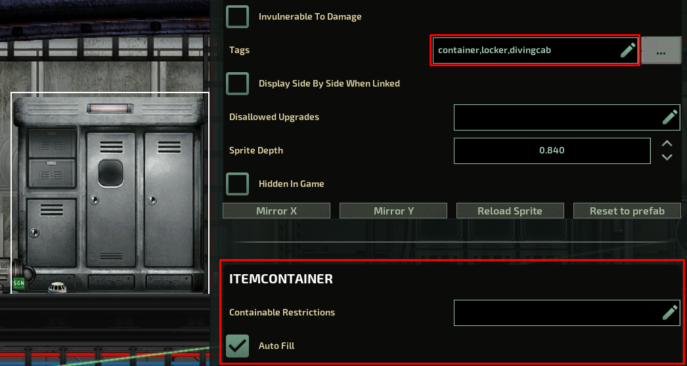

Some tags are defined in the prefab level, in the .xml files. Others need to be manually added in the editor. The important tags that need to be manually added are:

- **engcab**: Tools and other items need for the maintenance tasks.
- **reactorcab**: Reactor fuel, screwdrivers, and other items that might be needed in the reactor room.
- **divingcab**: Items needed when you exit the submarine. Plasma cutters, underwater scooters etc.
- **supplycab**: Emergency items and a diving mask.
- **armcab**: Weapons and ammunition.
- **secarmcab**: Lethal weapons and explosives.
- **medcab**: Medicines.
- **medfabcab**: Medical ingredients.
- **toxcab**: Poisons and dangerous substances.
- **storagecab**: Materials used for fabricating.
- **mineralcab**: Minerals.

**TIP:** You can also reserve the container for specific items only by adding tags or identifiers of those items in the 'Containable Restrictions' field.

## Equipment and security
To prevent traitors and other undesirables from causing too much damage, it may be smart to lock weapons and explosives somewhere where only authorized personnel can reach them.

To do this, add a tag to the 'picked required' field of a door. Then add the the same tag to at least one of the spawn points. The 'ID Card tags' defined in the spawnpoint are copied for all characters that spawn at that specific point, giving them access to different parts of the submarine.

For example: to only allow security officers to open a door, add a tag, e.g. 'id_security', to both the door and to the security officer’s spawn point. The tag can be whatever you define but it has to match in both places.

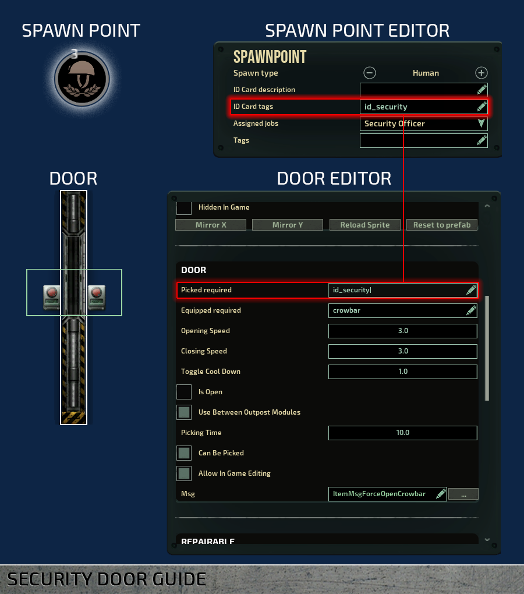

Now anyone who spawns at this spawn point has the tag ‘id_security’ on their ID Card, allowing them to open the door.

**TIP:** To place items in containers in sub editor, right\-click on the container and select ‘Open’ to open the interface. You can now search and filter items and place them in directly. To delete items from the container, drag and drop them to the entity catalog in the bottom.

**TIP** : The “picked required” field essentially means “the character has to have an item with this name or tag in their inventory to interact with this item/device”. It can be used to restrict access to other items than doors as well, or for example to require a specific tool to interact with some device.

## Waterproofing
There are a few ways to combat flooding inside a submarine.

Pumps are the primary way of getting rid of water, but they consume relatively high amounts of power. Having too many pumps turn on simultaneously causes unnecessary power fluctuations. Instead of placing pumps in every room, duct blocks can be used to let water flow into designated bilge compartments. There doesn’t need to be a separate bilge space, usually it is enough to place a pump on the bottom\-most room and route the water there.

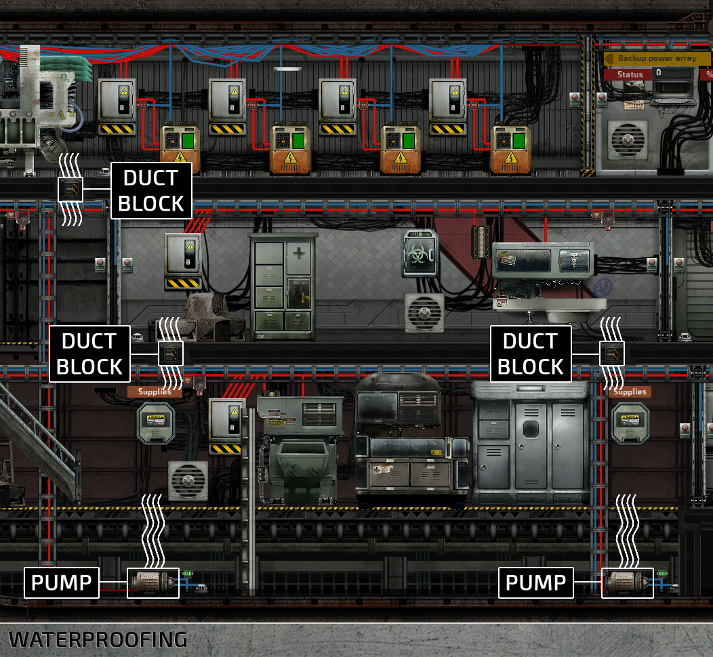

Compartmentalizing the space is a good way to make sure a small leak doesn’t turn into a catastrophe. The larger the rooms on a sub, the further water can advance without obstacles. Remember to close doors behind you, otherwise they’re useless. A good move would be to use doors that close automatically, which is why the game's vanilla subs come with auto\-closing doors. Hate them or love them, they're for your own protection!

## Waypoints
All AI characters need waypoints to get around the submarine. Waypoints can be placed manually, but a far easier way to do it is with the ‘Generate waypoints’ button on the left side of the screen. After waypoints are generated, they can be fine\-tuned manually, if needed.

It's a good practice to generate the waypoints once items and structures are already in place. Also, if you remove or add doors, stairs, or ladders, remember to add waypoints too to prevent the AI from getting stuck.

## Editing multiple properties
This highly requested feature has finally been implemented! If you have multiple entities selected and change a property in the top right entity editor, the changes will be applied to all items in your selection. This works for any item and any property. Colors, toggles, labels, tags...you name it.

**IMPORTANT:** Multiple editing has some limitations. For example, OxygenGenerator and Engine both have the Power Consumption property, but they can still not be edited simultaneously because they are part of different item components. By contrast, editing the ‘Auto Fill’ property on a Supplies Cabinet and a Steel Locker, for instance, will work, because the property that is being edited is part of the ItemContainer component which both items have.

## Autosaving
You might have noticed that there is a new button on the Load menu called Load Autosave. Every 5 minutes or when the game is paused, the editor will automatically save your submarine into a temporary file located in Submarines/.AutoSave/AutoSave.sub which will not show up in your submarine list.

If the power goes out, the game crashes, a random chimp event occurs or something else horrible happens after you’ve spent hours wiring the submarine and forgot to save, you can recover the AutoSave submarine from the Load menu.

**TIP:** All submarines share the same autosave file, so be careful what you load before recovering your submarine.

## Editor shortcuts
- W, A, S, D – Scroll
- Shift + W, A, S, D – Scroll faster
- Ctrl+1, Control+2 – Switch between edit and wiring mode.
- Q – Toggle entity catalog visibility.
- F – Centers the camera to selection.
- E – Open item interface.
- Ctrl+A – Select or deselect everything.
- Ctrl+S – Show save menu.
- Ctrl+Shift+S – Quick\-save your submarine.
- Ctrl+M, Ctrl+N – Flip item horizontally or vertically.
- Space + Left click – Link item to another \(Useful in linking hulls together or an oxygen generator to vents\).

Holding down shift while dragging or resizing items disables grid snapping.

## Thanks for reading!
We hope you found this guide helpful – feedback is always welcome, so let us know how we did. Be sure to post your subs on Barotrauma’s Steam workshop and on our [Discord server](http://discord.gg/undertow), where we have a channel dedicated to custom subs!

