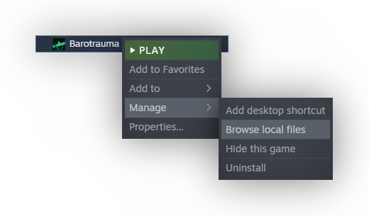

# Content packages

Content packages are collections of files that define many of the properties of the things that exist in Barotrauma. This includes [items](../ContentTypes/Item.md), [structures](../ContentTypes/Structure.md), [monsters](../ContentTypes/Character.md), [random events](../ContentTypes/RandomEvents.md), [level generation parameters](../ContentTypes/LevelGenerationParameters.md), [jobs](../ContentTypes/Jobs.md) and so on. You can see a full list of what content packages define in the [Content Types](ContentTypes.md) page.

By default the game uses a single content package called "Vanilla". Any other content package can be considered a modification of the game content, that is, a "mod".

Content packages largely consist of text files in a format called XML, along with any required textures and sounds. If you have no prior experience with the XML format, don’t worry – even though it may look intimidating at first, the format is pretty simple. Please see the [XML](XML.md) page for further details.

Any content package that you are editing should be found in a folder within the `LocalMods` directory, which can be found among the game files. To reach the game files, right click on Barotrauma in your Steam library, and go to `Manage > Browse local files`:


## File list

The file list is a vital part of every content package; it allows the game to know which other XML files to load and the purpose each of them serves. For any given mod, its filename will always be `filelist.xml`. The [submarine](../Editors/SubmarineEditor.md) and [character](../Editors/CharacterEditor.md) editors will generate a basic file list for each of your creations.

The root element of the content package has the following attributes:
- `name`: The name for this content package that is seen by players in-game.
- `modversion`: The version number of the mod. Typically, this will increment as new versions of the mod are published to the Workshop. Currently, this is simply a hint for modders to be able to check which version of a mod is being used.
- `gameversion`: The version number that this mod was last updated for. This may be used by the game to detect mods that need to be modified for backwards compatibility.
- `corepackage`: Whether or not the content package is a "core" package, [described in a separate section](#core-packages).

This root element then has a child element for each content XML file that needs to be loaded. The name of each of these child elements must be one of the content types listed in the [Content Types](ContentTypes.md) page.

The following example consists of a single file that defines an [Item file](../ContentTypes/Item.md).

```xml
<contentpackage name="Alien Wrench" modversion="1.0.0" gameversion="0.17.8.0" corepackage="false">
    <Item file="%ModDir%/alienwrench.xml" />
</contentpackage>
```

### Core packages

If you're not an advanced modder, you probably don't need to read this section.

Most mods are usually not core content packages, but instead add things to or modify things in the Vanilla content package (= the default content of the game).

Core packages are packages that contain all the necessary files to make the game run, instead of just adding some extra files on top of another content package. There can only be one core package selected at a time.

This kind of package exists for mods that are extremely thorough and require disabling content from the vanilla game outright. Typically this is not what you want to use, as [overrides](Overrides.md) are usually sufficient and core mods are likely to break as we make updates that add more required files.
