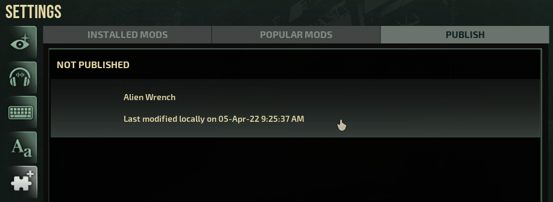
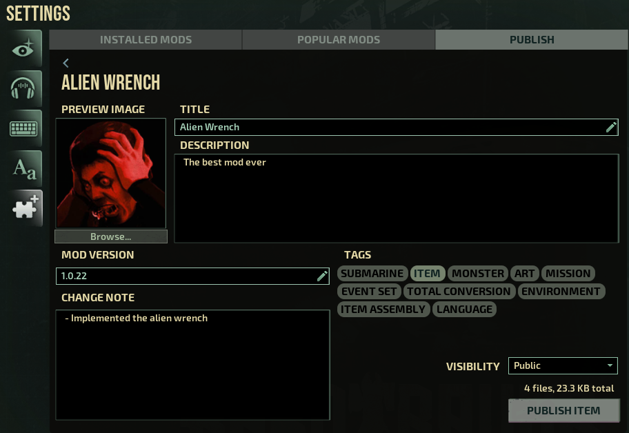
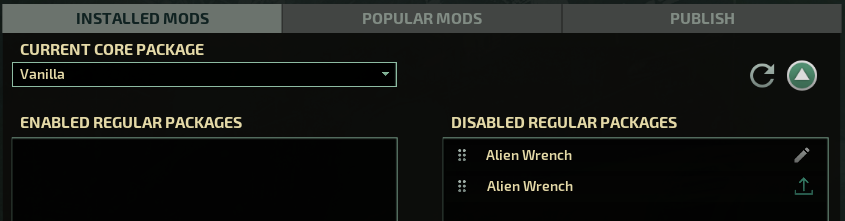

# Publishing to Steam Workshop

Once you have put together a mod that you wish to share with the world, you can publish it to Steam Workshop through the "Publish" tab in the modding menu. It's worth noting that this isn't required to host servers with mods, as players will be able to download any required mods directly from your server.

Once you click on your non-published mod, you will be greeted with the following screen:

You'll want to write a description, select a preview image, pick tags, write a change note and choose who gets to see it.

Once you hit the "Publish" button, the game will upload it to the Workshop, install it and, if required, open the Steam overlay to ask you to accept the Steam Subscriber Agreement.

## Local vs. Workshop mods

Once you have published a mod, you may notice in the "Installed Mods" tab that two versions of your mod are available:

The reason for this is that you may continue to edit your mod in the `LocalMods` folder, while still being able to host servers with the version you last published to the Workshop. This also makes sure that the game won't accidentally overwrite your work if, for example, you allow other people to submit updates to your item.
